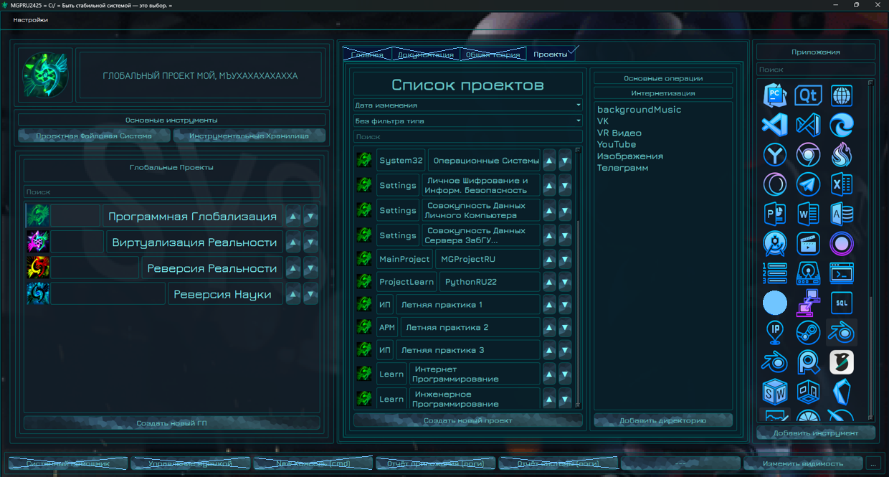

#  MGProjectRU / AutomaticRU2526

---

A Python-based modular platform for managing, building, and evolving **global projects** and complex development workflows.

The system is designed as a long-term ecosystem rather than a single application.

---

## UI Preview / Интерфейс

**Main Window - Dashboard**



---

## Project Status
**ACTIVE DEVELOPMENT / RESEARCH / EXPERIMENTAL**

Architecture, internal APIs, and modules may change.

---

## Description (EN) 

MGSD is a modular development platform focused on **global projects** - projects that consist of multiple subsystems, tools, resources, and long-term data.

The platform provides:
- 📦 **Global Projects Manager** - unified project structure and lifecycle
- 🧩 **Modular architecture** *(WIP)* - independent subsystems and services
- ⚙️ **Build & compilation orchestration** *(WIP)* - automated pipelines
- 🧠 **Auxiliary tools** *(WIP)* - recognition, analysis, automation
- 🗂 **Structured data handling** *(WIP)* - resources, metadata, backups

MGSD acts as a **foundation layer** for applications, tools, research prototypes, and game-related projects.

---

## Описание (RU)

Это модульная платформа на Python, предназначенная для сопровождения **глобальных проектов** - сложных систем, состоящих из множества модулей, инструментов и данных.

Платформа предоставляет:
- 📦 **Менеджер глобальных проектов**
- 🧩 **Модульную архитектуру** *(в разработке)*
- ⚙️ **Систему сборки и компиляции** *(в разработке)*
- 🧠 **Вспомогательные инструменты** *(в разработке)*
- 🗂 **Структурированную работу с ресурсами и бэкапами** *(в разработке)*

MGSD - это не одно приложение, а **экосистема и среда разработки**, развивающаяся вместе с проектами внутри неё.

---

## Repository Structure

```text
AutomaticRU2526/
│
├─ .github/
│  └─ workflows/
│     └─ cla.yml                 # CLA Assistant (Contributor License Agreement)
│
├─ .venv/                        # Python virtual environment (ignored by git)
├─ BackData/                     # Runtime data / backups (ignored)
│
├─ AutomaticRU2526               # Entry Point
├─ WorkArchiveFiles              # Archive Data
├─ WorkDataManager               # Work Data
├─ WorkDiskManager               # Work Disk
├─ WorkJSONFiles                 # Work Json Files
├─ WorkMouseDesign               # Pony Pet or just Pet
├─ WorkProjectManager            # Use Json Files in save projects data
├─ WorkUserInterfaceManager      # User Qt Interface from PySide6
│
├─ resources/                    # Shared resources (icons, configs, assets)
├─ TemplateProject/              # Core project logic
├─ github-pictures/              # README / documentation images
│
├─ .gitignore                    # Git ignore rules
├─ LICENSE                       # GNU GPL v3 license
├─ COMMERCIAL_LICENSE.md         # Commercial (proprietary) license terms
├─ CONTRIBUTING.md               # Contribution rules & CLA text
├─ NOTICE.md                     # Third-party licenses and notices
│
├─ requirements.txt              # GPL-safe Python dependencies
├─ requirements-commercial.txt   # Commercial-only dependencies
│
├─ main.spec                     # PyInstaller build specification generate
│
└─ README.md                     # Project documentation

```

---

## Non-Versioned Resources (Not Included in Repository)

This repository intentionally does **not** include certain runtime resources, such as UI assets and media files.

These files are considered:
- environment-specific,
- replaceable,
- or subject to separate licensing or customization.

### Expected Local Structure

At runtime, the project expects the following directory structure inside `resources/`:

```text
resources/
├─ audio/                     # Audio assets (sound effects, voice data, etc.)
│
├─ img/                       # UI and visual assets
│  ├─ *.png
│  ├─ *.gif
│  ├─ *.png
│  ├─ *.png
│  ├─ *.png
│  ├─ *.png
│  ├─ *.png
│  ├─ *.png
│  ├─ *.png
│  └─ *.png
│
└─ __init__.py
```

---

## Licensing & Credits

### Project Code

All source code in this repository is licensed under the
**GNU General Public License v3 (GPL v3)**.

This means:

* You are free to use, study, and modify the code.
* Any derivative work **must remain open-source under GPL v3**.
* Proprietary or closed-source redistribution is **not permitted** without explicit permission.

### Commercial Use

This project follows a **dual-licensing model**.

If you wish to use MGSD, or parts of it, in a **proprietary or closed-source product**,
you must obtain a **separate commercial license**.

📩 Please contact the project author to discuss commercial licensing terms.

### Frameworks & Third-Party Software

* **PySide6 / Qt for Python** - LGPL v3
  Used as an external dependency without modification, in compliance with LGPL requirements.
* **Icons** - provided by [Icons8](https://icons8.com).
  Please verify their license terms for commercial usage.

A full list of third-party licenses is available in **NOTICE.md**.

### Contributions

By contributing to this project, you agree to the terms described in **CONTRIBUTING.md**,
including acceptance of the **Contributor License Agreement (CLA)**.

---

## Platform Support

* ✅ Windows / PC (Python)
* ❌ Android - not supported
* ❌ Linux - not supported

---

## Related Projects

AutomaticRU2526 may include or support independent projects and modules, such as:

* desktop applications,
* automation tools,
* research systems,
* game-related projects.

One such project is **Starline Lab**, a separate Mindustry content mod, maintained as an **independent subproject** and documented separately.

---

## Notes

* The platform is under active development
* Internal architecture may change
* Some modules are experimental or incomplete
* Documentation will expand alongside the system

---

*MGSD - when projects stop being folders and start becoming systems.*


## Дополнения по использованию / типа Документация

- Список файлов и директорий создаётся в `system_tools.py`